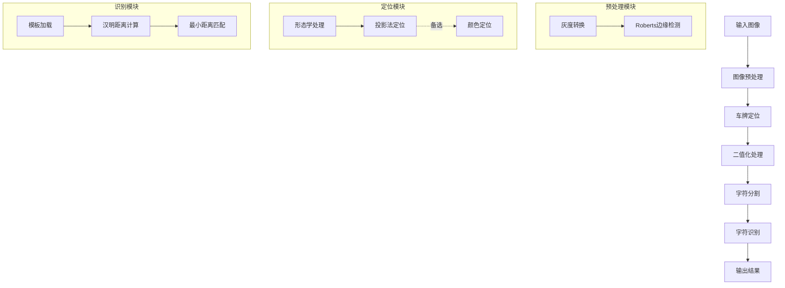

# 车牌识别系统 (License Plate Recognition System)

基于 MATLAB 的车牌识别系统，采用模块化设计，提供完整的 GUI 界面，支持中国车牌的自动识别。


---

## 📋 目录

- [项目简介](#项目简介)
- [系统功能](#系统功能)
- [系统架构](#系统架构)
- [算法原理](#算法原理)
- [文件结构](#文件结构)
- [使用方法](#使用方法)
- [处理流程详解](#处理流程详解)
- [模块功能说明](#模块功能说明)
- [测试结果](#测试结果)
- [技术特点](#技术特点)
- [常见问题](#常见问题)

---

## 项目简介

本项目是一个完整的中国车牌识别系统，使用 MATLAB 开发。系统能够识别标准中国蓝色车牌，支持：
- **省份汉字识别**：京、沪、粤、津、苏、浙、鄂、陕、豫、桂、贵、琼、湘、皖、鲁、新、赣、黑、晋、蒙、吉、闽、青、藏、川、宁、渝、辽、冀、甘、云 等 31 个省份
- **字母识别**：A-Z（不含 I、O）
- **数字识别**：0-9

系统采用模板匹配方法进行字符识别，使用汉明距离（Hamming Distance）作为相似度度量。

---

## 系统功能

### 核心功能
1. **图像预处理**：灰度转换、边缘检测
2. **车牌定位**：形态学处理 + 投影法定位，支持颜色辅助定位
3. **字符分割**：支持粘连字符分割、噪声过滤
4. **字符识别**：基于模板匹配的汉明距离识别
5. **结果保存**：自动保存所有中间处理步骤

### GUI 功能
- 可视化显示原图、灰度图、边缘检测、车牌定位、二值化等处理步骤
- 展示分割后的 7 个字符
- 显示识别结果及置信度
- 处理结果自动保存到独立文件夹

---

## 系统架构



---

## 算法原理

### 1. 图像预处理

#### 灰度转换
将彩色图像转换为灰度图，减少计算复杂度：
```matlab
grayImg = rgb2gray(img);
```

#### Roberts 边缘检测
使用 Roberts 交叉梯度算子检测边缘，突出车牌区域的边缘特征：
```matlab
edgeImg = edge(grayImg, 'roberts', 0.15, 'both');
```

Roberts 算子是一种 2×2 的差分算子，计算公式：
- Gx = f(i,j) - f(i+1,j+1)
- Gy = f(i+1,j) - f(i,j+1)
- G = √(Gx² + Gy²)

### 2. 车牌定位

#### 形态学处理
1. **腐蚀操作**：使用垂直结构元素，去除水平线干扰
2. **闭运算**：填充车牌区域内的空隙
3. **去除小对象**：过滤面积小于 2000 像素的干扰区域

```matlab
se1 = [1; 1; 1];  % 垂直结构元素
I_erode = imerode(edgeImg, se1);

se2 = strel('rectangle', [25, 25]);
I_close = imclose(I_erode, se2);

I_clean = bwareaopen(I_close, 2000);
```

#### 投影法定位
1. **垂直投影**：统计每行的白色像素和，找到车牌的上下边界
2. **水平投影**：在车牌行范围内，统计每列的白色像素和，找到左右边界

```matlab
% Y方向投影
Blue_y = zeros(y, 1);
for i = 1:y
    Blue_y(i, 1) = sum(myI(i, :));
end
```

#### 颜色辅助定位（备选方案）
当形态学定位失败时，使用 HSV 颜色空间检测蓝色车牌区域：
- H (色调): 0.55-0.72（蓝色范围）
- S (饱和度): ≥0.35
- V (亮度): ≥0.15

### 3. 二值化处理

#### 自适应阈值二值化
根据图像的灰度分布自动计算阈值：
```matlab
T = g_max - (g_max - g_min) / 3;
binaryImg = double(grayPlate) >= T;
```

#### 均值滤波去噪
使用 3×3 均值滤波模板平滑图像：
```matlab
h = fspecial('average', 3);
binaryImg = im2bw(round(filter2(h, binaryImg)));
```

#### 形态学调整
根据白色区域占比自动进行膨胀或腐蚀：
- 占比 ≥ 36.5%：进行腐蚀
- 占比 ≤ 23.5%：进行膨胀

### 4. 字符分割

#### 边缘裁剪
使用 `qiege()` 函数去除二值图像的空白边缘，获取最小包围矩形。

#### 字符边界检测
通过分析每列的像素和，找到连续非零列作为字符区域：
```matlab
s = sum(d);  % 每列的白色像素和
```

#### 粘连字符处理
当检测到字符宽度超过预期的 1.5 倍时，在中间区域找最小投影位置进行分割：
```matlab
if width > avgWidth * 1.5
    region = sum(d(:, midStart:midEnd));
    [~, minIdx] = min(region);
    splitPoint = midStart + minIdx - 1;
end
```

#### 分隔点过滤
过滤车牌中的分隔点（·），判断条件：
- 面积过小
- 宽高比接近 1:1

### 5. 字符识别

#### 模板匹配
使用预生成的字符模板（40×20 像素）进行匹配。

#### 汉明距离计算
计算待识别字符与模板之间的汉明距离：
```matlab
Dmax = 0;
for i = 1:40
    for j = 1:20
        Dmax = Dmax + xor(SegBw2_binary(i,j), SamBw2_binary(i,j));
    end
end
```

汉明距离表示两个等长二进制字符串中对应位置不同的位数。距离越小，相似度越高。

#### 搜索范围优化
根据字符位置限制搜索范围：
- **第 1 位**：只搜索汉字（省份简称）
- **第 2 位**：只搜索字母 A-Z
- **第 3-7 位**：搜索数字 0-9 和字母 A-Z

#### 置信度计算
```matlab
confidence = 1 - MinError / (40 * 20);
```

---

## 文件结构

```
车牌识别/
├── main_gui.m              # 主程序 - GUI界面
├── generate_templates.m    # 模板生成脚本
├── learn_templates.m       # 模板学习工具（从分割结果学习）
├── debug_*.m              # 调试脚本
├── README.md              # 项目说明文档
│
├── modules/               # 功能模块目录
│   ├── preprocess.m       # 图像预处理模块
│   ├── locate_plate.m     # 车牌定位模块
│   ├── binarize_plate.m   # 二值化模块
│   ├── segment_chars.m    # 字符分割模块
│   ├── recognize_chars.m  # 字符识别模块
│   ├── normalize_char.m   # 字符归一化模块
│   ├── qiege.m           # 边缘裁剪函数
│   └── getword.m         # 字符提取函数
│
├── templates/             # 字符模板目录（40×20 像素 BMP 文件）
│   ├── 0.bmp ~ 9.bmp     # 数字模板
│   ├── A.bmp ~ Z.bmp     # 字母模板
│   └── 京.bmp, 沪.bmp... # 省份汉字模板
│
├── test_images/           # 测试图像目录
│   ├── 陕A.jpg
│   ├── 粤F.jpg
│   ├── 苏E.jpg
│   └── ...
│
└── results/               # 识别结果保存目录
    └── YYYYMMDD_HHMMSS/  # 按时间戳命名的结果文件夹
        ├── 01_原图.jpg
        ├── 02_灰度图.jpg
        ├── 02_灰度直方图.png
        ├── 03_边缘检测.jpg
        ├── 04_形态学处理.jpg
        ├── 05_定位车牌.jpg
        ├── 06_二值化.jpg
        ├── 07_均值滤波.jpg
        ├── 08_形态学调整.jpg
        ├── 09_字符1~7.jpg
        └── recognition_result.txt
```

---

## 使用方法

### 环境要求
- MATLAB R2018a 或更高版本
- Image Processing Toolbox

### 运行步骤

#### 1. 生成字符模板（首次运行）
```matlab
>> generate_templates
```
这将在 `templates/` 目录下生成所有字符的模板图像。

#### 2. 启动主程序
```matlab
>> main_gui
```

#### 3. 操作流程
1. 点击 **"选择图像"** 按钮，选择待识别的车牌图像
2. 点击 **"开始识别"** 按钮，系统将自动完成识别
3. 查看识别结果和各处理步骤的可视化展示
4. 结果自动保存到 `results/` 目录下

### 模板学习（可选）
如果识别效果不理想，可以使用模板学习工具从实际分割结果中学习更准确的模板：
```matlab
>> learn_templates
```
按提示输入字符标签即可更新模板。

---

## 处理流程详解

| 步骤 | 文件 | 输出 | 说明 |
|:---:|:---|:---|:---|
| 1 | `preprocess.m` | 01_原图.jpg | 保存原始输入图像 |
| 2 | `preprocess.m` | 02_灰度图.jpg | RGB 转灰度 |
| 3 | `preprocess.m` | 02_灰度直方图.png | 灰度分布直方图 |
| 4 | `preprocess.m` | 03_边缘检测.jpg | Roberts 边缘检测结果 |
| 5 | `locate_plate.m` | 04_形态学处理.jpg | 腐蚀+闭运算+去噪 |
| 6 | `locate_plate.m` | 05_定位车牌.jpg | 裁剪出的车牌区域 |
| 7 | `binarize_plate.m` | 06_二值化.jpg | 自适应阈值二值化 |
| 8 | `binarize_plate.m` | 07_均值滤波.jpg | 3×3 均值滤波后的结果 |
| 9 | `binarize_plate.m` | 08_形态学调整.jpg | 膨胀/腐蚀调整后的结果 |
| 10 | `segment_chars.m` | 09_字符1~7.jpg | 7 个分割后的字符 |
| 11 | `recognize_chars.m` | recognition_result.txt | 识别结果及置信度 |

---

## 模块功能说明

### preprocess.m（预处理模块）
**输入**：原始彩色图像  
**输出**：灰度图像、边缘检测图像

**功能**：
1. 将彩色图像转换为灰度图
2. 使用 Roberts 算子进行边缘检测（阈值 0.15）
3. 保存中间结果用于可视化

---

### locate_plate.m（车牌定位模块）
**输入**：边缘图像、原始彩色图像  
**输出**：裁剪的车牌图像、车牌位置坐标

**功能**：
1. **主定位方法**：形态学处理 + 投影法
   - 垂直腐蚀去除水平干扰
   - 闭运算填充空隙
   - 垂直/水平投影确定边界
2. **备选方法 1**：HSV 颜色空间蓝色检测
3. **备选方法 2**：尝试不同形态学参数组合
4. **后备方案**：返回图像中心区域

---

### binarize_plate.m（二值化模块）
**输入**：车牌彩色图像  
**输出**：二值化的车牌图像

**功能**：
1. 灰度转换
2. 自适应阈值计算：T = max - (max - min) / 3
3. 3×3 均值滤波去噪
4. 根据白色区域比例自动膨胀或腐蚀

---

### segment_chars.m（字符分割模块）
**输入**：二值化车牌图像  
**输出**：7 个字符图像（40×20 像素）

**功能**：
1. 边缘裁剪去除空白
2. 分析列投影找到字符边界
3. 处理粘连字符（宽度超过预期 1.5 倍时分割）
4. 过滤分隔点（面积过小或宽高比接近 1:1）
5. 不足 7 个字符时使用等宽分割
6. 多于 7 个字符时去除最小的
7. 归一化到 40×20 尺寸

---

### recognize_chars.m（字符识别模块）
**输入**：7 个字符图像、模板目录  
**输出**：识别结果字符串、置信度数组

**功能**：
1. 加载对应位置的候选模板
2. 对每个字符计算与所有候选模板的汉明距离
3. 选择距离最小的模板作为识别结果
4. 计算置信度

**字符代码表**：
```
0-9:  索引 1-10
A-Z:  索引 11-36
汉字: 索引 37+
```

---

### normalize_char.m（字符归一化模块）
**输入**：任意大小的字符图像  
**输出**：40×20 像素的归一化图像

**功能**：
1. 灰度转换和二值化
2. 去除小噪点
3. 裁剪到内容区域
4. 保持宽高比缩放
5. 居中放置

---

### qiege.m（边缘裁剪函数）
**输入**：二值图像  
**输出**：去除空白边缘的最小包围矩形

**功能**：
从上下左右四个方向扫描，找到实际内容的边界。

---

### getword.m（字符提取函数）
**输入**：二值化车牌图像  
**输出**：单个字符图像、剩余图像

**功能**：
从左到右扫描，找到连续非零列作为一个字符，过滤过窄的噪声干扰。

---

## 测试结果

### 测试图像

| 图像文件 | 预期结果 | 说明 |
|:---|:---|:---|
| 陕A.jpg | 陕A·XXXXX | 陕西省车牌 |
| 粤F.jpg | 粤F·XXXXX | 广东省车牌 |
| 苏E.jpg | 苏E·XXXXX | 江苏省车牌 |
| 浙B.jpg | 浙B·XXXXX | 浙江省车牌 |
| 沪C.jpg | 沪C·XXXXX | 上海市车牌 |
| 桂K.jpg | 桂K·XXXXX | 广西壮族自治区车牌 |
| 琼B.jpg | 琼B·XXXXX | 海南省车牌 |
| 贵E.jpg | 贵E·XXXXX | 贵州省车牌 |
| 鄂A.jpg | 鄂A·XXXXX | 湖北省车牌 |

### 结果输出格式
识别结果保存在 `results/<时间戳>/recognition_result.txt` 中：
```
识别结果: 陕A906L4
置信度: 0.85 0.92 0.88 0.90 0.87 0.91 0.89 
处理时间: 29-Dec-2024 12:00:00
```

---

## 技术特点

### 优点
1. **模块化设计**：各功能独立，便于维护和扩展
2. **多重定位策略**：形态学定位失败时自动切换到颜色定位
3. **自适应处理**：阈值、形态学参数根据图像自动调整
4. **完整可视化**：保存所有中间处理步骤，便于调试和分析
5. **模板学习**：支持从实际分割结果学习模板，提高识别准确率

### 局限性
1. 主要支持标准蓝色车牌，对新能源车牌（绿色）支持有限
2. 复杂光照条件下可能定位失败
3. 倾斜角度较大的车牌识别效果下降
4. 模糊或遮挡的车牌难以识别

### 可能的改进方向
1. 添加图像倾斜校正
2. 使用深度学习方法提升识别准确率
3. 支持更多类型的车牌（新能源、武警等）
4. 优化处理速度

---

## 常见问题

### Q1: 运行时提示找不到模板文件
**A**: 请先运行 `generate_templates` 生成模板文件。

### Q2: 车牌定位失败
**A**: 可能是光照条件不佳或车牌角度过大。尝试使用更清晰、角度正面的图像。

### Q3: 识别结果不准确
**A**: 
1. 运行 `learn_templates` 从实际分割结果学习模板
2. 检查分割后的字符图像是否正常

### Q4: 如何处理新类型的车牌
**A**: 修改 `locate_plate.m` 中的颜色检测范围，或在 `generate_templates.m` 中添加新字符。

---

## 参考资料

1. 数字图像处理（冈萨雷斯）
2. MATLAB 图像处理工具箱文档
3. 中国机动车号牌标准（GA 36-2007）

---

## 作者信息

- **项目类型**：图像处理实验项目
- **开发环境**：MATLAB R2018a+
- **更新日期**：2024年12月

---

## 许可证

本项目仅供学习和研究使用。
