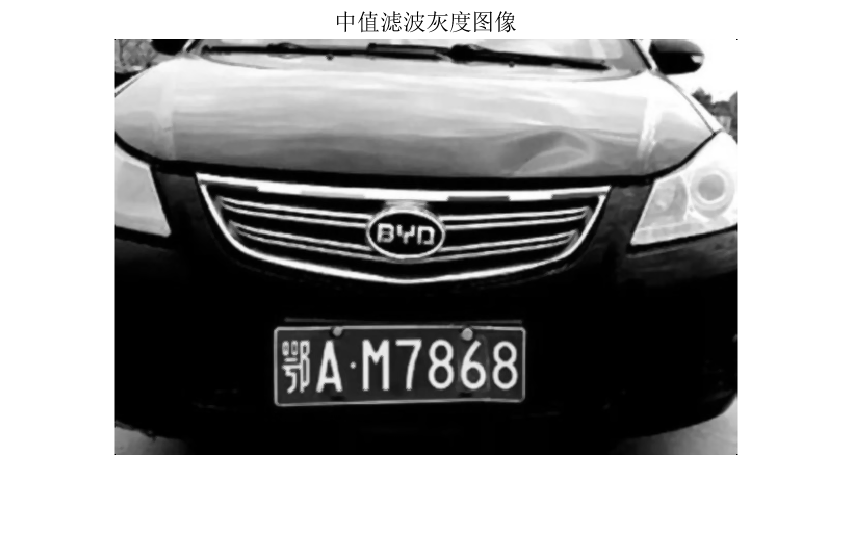
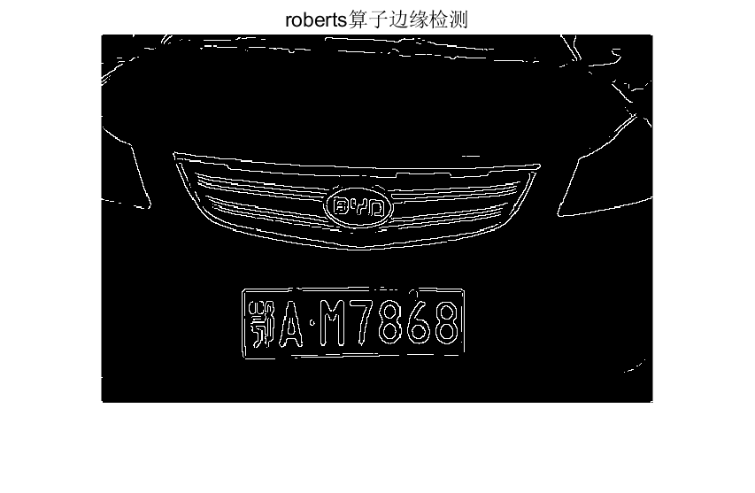
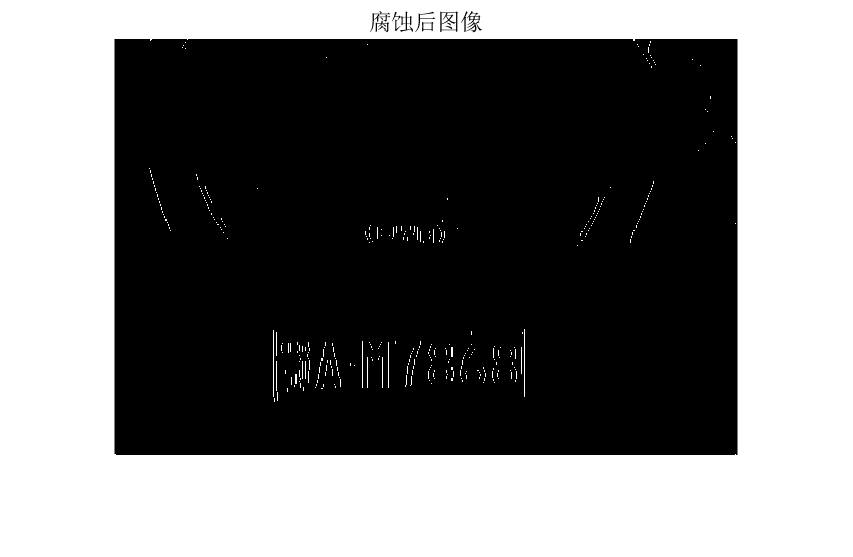
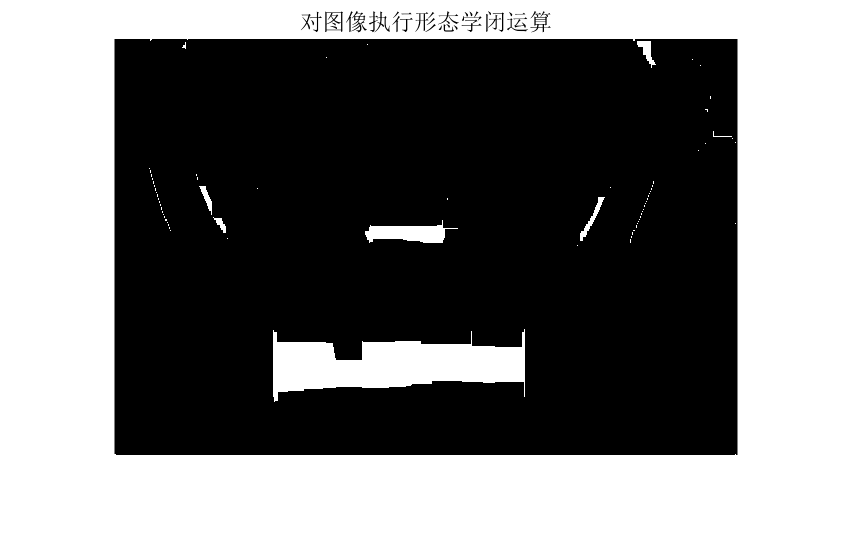
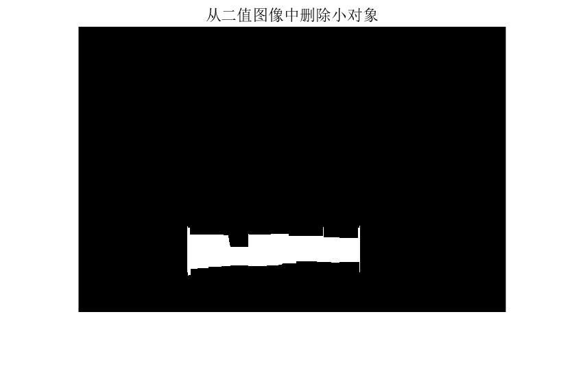
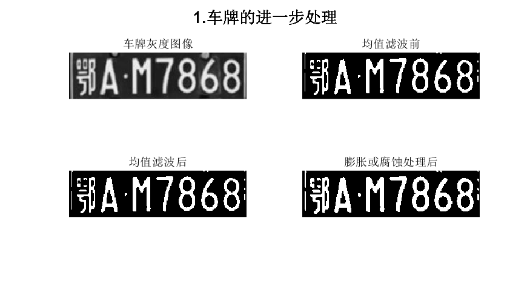
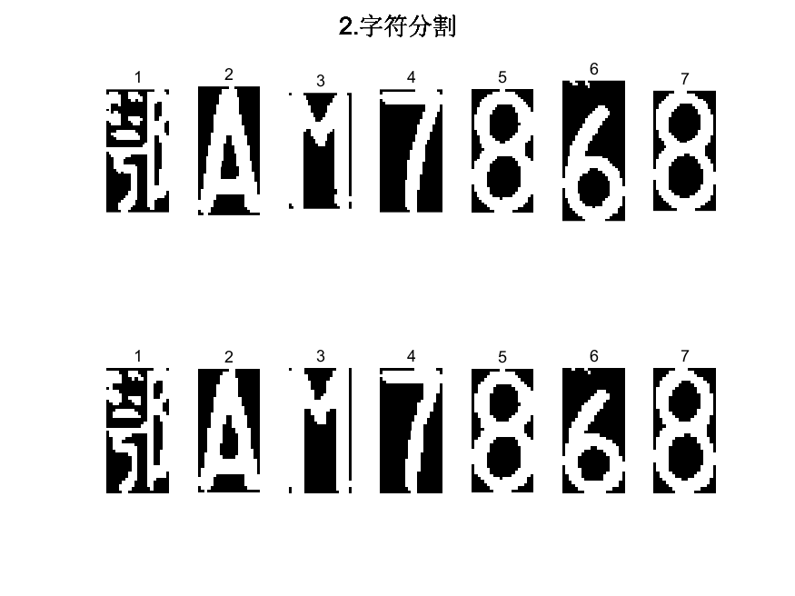

<h1 style="text-align:center">四、基于MATLAB的汽车牌照识别系统的设计与实现</h1>

# 0   开源声明
本项目采用LGPL协议开源，请您在使用、修改或分发本项目时，遵循LGPL协议规定，保证开源您的修改版本。

# 1   设计目的
车辆牌照识别系统(License Plate Recognition System，简称LPRS)是建设智能交通系统不可或缺的部分。基于 MATLAB的汽车牌照识别系统是通过引入数字摄像技术和计算机信息管理技术，采用先进的图像处理、模式识别和人工智能技术，通过对图像的采集和处理，获得更多的信息，从而通过智能识别车牌来达到更高的智能化管理程度。

# 2   设计任务及具体要求
车牌识别系统整个处理过程分为预处理、边缘提取、车牌定位、字符分割、字符识别五大模块，用 MATLAB软件编程来实现每一个部分处理过程，最后使得计算机可以自主识别汽车牌照。

# 3   基本原理概述
基于 MATLAB图像处理的汽车牌照识别系统主要包括图像预处理、车牌定位、车牌的进一步处理、字符分割和字符识别五个关键环节，其识别流程图如图所示。



<div style="text-align:center">车牌识别流程框图<div>

# 4   设计方案及验证
## 一、图像预处理
对车牌图像进行中值滤波、边缘检测、腐蚀、形态学闭运算、删除小对象等处理等，以克服图像干扰，并更好地进行车牌定位和字符分割。
```MATLAB
% 1.RGB转灰度中值滤波
I1=rgb2gray(I);%RGB转灰度
I1=medfilt2(I1,[3 3]);%中值滤波
```

```MATLAB
% 2.用roberts算子进行边缘检测
I2=edge(I1,'roberts',0.15,'both');%选择阈值0.15，用roberts算子进行边缘检测
```

```MATLAB
% 3.图像实施腐蚀操作
se=[1;1;1];
I3=imerode(I2,se);%对图像实施腐蚀操作，即膨胀的反操作
```

```MATLAB
% 4.对图像执行形态学闭运算
se=strel('rectangle',[25,25]);%构造结构元素以正方形构造一个se
I4=imclose(I3,se);% 对图像执行形态学闭运算
```

```MATLAB
% 5.从二值图像中删除小对象
I5=bwareaopen(I4,2000);% 去除聚团灰度值小于2000的部分
```

## 二、车牌定位
计算边缘图像的投影面积，寻找峰谷点，大致确定车牌位置，再计算此连通域内的宽高比，剔除不在域值范围内的连通域，最后得到车牌字符区域。


车牌定位设计思路及分析：

### 1 Y方向车牌区域确定：
统计图像中每一行的蓝色像素点数量，保存在Blue_y向量中。

```MATLAB
%%Y方向车牌区域确定%%
Blue_y=zeros(y,1);%产生一个y*1的零阵
for i=1:y
    for j=1:x
        if(myI(i,j,1)==1)
            %如果myI(i,j,1)即myI的图像中坐标为(i,j)的点值为1，即该点为车牌背景颜色蓝色，则Blue_y(i,1)的值加1
            Blue_y(i,1)= Blue_y(i,1)+1;%蓝色像素点统计
        end
    end
end
```
根据蓝色像素点数量，确定车牌区域Y方向范围，存储在PY1和PY2中。
```MATLAB
[temp MaxY]=max(Blue_y);%Y方向车牌区域确定
%temp为向量white_y的元素中的最大值，MaxY为该值的索引
PY1=MaxY;
while ((Blue_y(PY1,1)>=5)&&(PY1>1))
    PY1=PY1-1;
end
PY2=MaxY;
while ((Blue_y(PY2,1)>=5)&&(PY2<y))
    PY2=PY2+1;
end
IY=I(PY1:PY2,:,:);
```
### 2 X方向车牌区域确定：
进一步在Y方向确定的车牌区域内，统计每一列的蓝色像素点数量，保存在Blue_x向量中。

```MATLAB
%%X方向车牌区域确定%%
Blue_x=zeros(1,x);%进一步确定x方向的车牌区域
for j=1:x
    for i=PY1:PY2
        if(myI(i,j,1)==1)
            Blue_x(1,j)= Blue_x(1,j)+1;
        end
    end
end
```
根据蓝色像素点数量，确定车牌区域X方向范围，存储在PX1和PX2中。
```MATLAB
PX1=1;
while ((Blue_x(1,PX1)<3)&&(PX1<x))
    PX1=PX1+1;
end
PX2=x;
while ((Blue_x(1,PX2)<3)&&(PX2>PX1))
    PX2=PX2-1;
end
```
对X方向的车牌区域进行校正。
```MATLAB
PX1=PX1-1;%对车牌区域的校正
PX2=PX2+1;
dw=I(PY1:PY2,PX1:PX2,:);
```
### 3 裁剪并显示车牌区域：
根据Y和X的范围，裁剪原始图像获得车牌区域，保存在IY和dw中。

```MATLAB
dw=I(PY1:PY2,PX1:PX2,:);
figure(6),subplot(1,2,1),imshow(IY),title('行方向合理区域');%行方向车牌区域确定
figure(6),subplot(1,2,2),imshow(dw),title('定位裁剪后的车牌彩色图像');%的车牌区域如下所示：
```
车牌定位部分，通过分析图像的蓝色像素点数量来确定车牌的粗略位置，然后在Y和X方向上进行细致的确定，最终裁剪出车牌区域。

## 三、车牌的进一步处理 



车牌的进一步处理模块代码分析：

### 1 灰度图像二值化及均值滤波：

计算灰度图像的最大值(g_max)和最小值(g_min)。

计算二值化阈值(T)，使用一个简单的阈值策略。

根据阈值进行二值化，得到二值图像(d)。

使用均值滤波对二值图像进行平滑。
```MATLAB
%% 三、车牌的进一步处理
imwrite(dw,'彩色车牌.jpg');%将彩色车牌写入彩色车牌文件中
a=imread('彩色车牌.jpg');%读取车牌文件中的数据
b=rgb2gray(a);%将车牌图像转换为灰度图
imwrite(b,'车牌灰度图像.jpg');%将灰度图像写入文件中
figure(7);subplot(3,2,1),imshow(b),title('车牌灰度图像')
g_max=double(max(max(b)));
g_min=double(min(min(b)));
T=round(g_max-(g_max-g_min)/3); % T 为二值化的阈值
[m,n]=size(b);
d=(double(b)>=T); % d:二值图像
imwrite(d,'均值滤波前.jpg');
subplot(3,2,2),imshow(d),title('均值滤波前')
%均值滤波前
% 滤波
h=fspecial('gaussian',3);
%建立预定义的滤波算子，average为均值滤波，模板的尺寸为3*3
d=im2bw(round(filter2(h,d)));%使用指定的滤波器h对h进行d即均值滤波
imwrite(d,'均值滤波后.jpg');
subplot(3,2,3),imshow(d),title('均值滤波后')
```
### 2 膨胀或腐蚀处理：

判断二值图像中对象的总面积与整个面积的比是否在特定范围内。

如果比例大于0.365，执行腐蚀操作；如果比例小于0.235，执行膨胀操作。

选择结构元素为单位矩阵，即se=eye(2)。
```MATLAB
% 某些图像进行操作
% 膨胀或腐蚀
% se=strel('square',3); % 使用一个3X3的正方形结果元素对象对创建的图像进行膨胀
% 'line'/'diamond'/'ball'...
se=eye(2); % eye(n) returns the n-by-n identity matrix 单位矩阵
[m,n]=size(d);%返回矩阵b的尺寸信息， 并存储在m,n中
if bwarea(d)/m/n>=0.365 %计算二值图像中对象的总面积与整个面积的比是否大于0.365
    d=imerode(d,se);%如果大于0.365则图像进行腐蚀
elseif bwarea(d)/m/n<=0.235 %计算二值图像中对象的总面积与整个面积的比是否小于0.235
    d=imdilate(d,se);%如果小于则实现膨胀操作
end
imwrite(d,'膨胀或腐蚀处理后.jpg');
subplot(3,2,4),imshow(d),title('膨胀或腐蚀处理后');
sgtitle('1.车牌的进一步处理');
saveas(gca,'fig7_1.车牌的进一步处理.png');
```
车牌的进一步处理模块旨在对车牌进行预处理，包括转二值化、均值滤波和形态学处理。这有助于更好地进行后续的字符分割。

## 四、字符分割



字符分割模块代码分析：

### 1 调用子函数进行字符分割：

d=qiege(d): 调用子函数qiege进行字符分割。

### 2 迭代切割连续有文字的块：

迭代循环，找到连续有文字的块，并判断长度是否大于某个阈值。

如果大于阈值，认为该块有两个字符组成，需要进行分割。

分割操作通过将中间一列置零实现。

### 3 再次调用字符分割子函数：

d=qiege(d): 再次调用子函数qiege进行字符分割。

### 4 切割出7个字符并归一化：

利用循环和条件判断，将车牌的字符分割成7个部分。

进行归一化处理，将字符的大小调整为40x20。

这部分代码通过调用子函数和迭代切割操作，将车牌的字符进行有效的分割，并显示出每个字符。

## 五、字符识别

通过基于模板匹配的OCR算法，得到最后的汽车牌照，包括省份简称、英文字母和数字。具体识别方法是求解输入字符与模板字符的汉明距离，取汉明距离最小的模板字符为OCR输出结果。


字符识别模块代码分析：

### 1 建立字符代码表：

建立包含数字、大写字母和部分省份简称的字符代码表。

```MATLAB
%% 五、车牌匹配识别
liccode=char(['0':'9' 'A':'Z' '京沪粤津苏浙鄂陕豫桂贵琼']); %建立字符代码表
SubBw2_binary=zeros(40,20); %产生40*20的全0矩阵
l=1;
```
### 2 归一化、二值化：

使用循环读取切割后的字符图像文件，归一化为40x20的大小，用固定阈值（20）进行二值化。

```MATLAB
for I=1:7
    ii=int2str(I); %转为串
    t=imread([ii,'.jpg']); %读取图片文件中的数据
    SegBw2=imresize(t,[40 20],'nearest'); %对图像做缩放处理
    SegBw2_binary=double(SegBw2)>20; %固定阈值二值化
```
### 3 区分识别类型：

第一位是汉字，第二位是字母，第三位以后是字母或数字。

```MATLAB
    if l==1 %第一位汉字识别
        kmin=37;
        kmax=48;
    elseif l==2 %第二位 A~Z 字母识别
        kmin=11;
        kmax=36;
    else l>=3 %第三位以后是字母或数字识别
        kmin=1;
        kmax=36;
    end
```
### 4 字符模板匹配：

使用字符模板进行匹配，计算每个字符与模板的汉明距离。

选择匹配误差最小的字符模板。
```MATLAB
    for k2=kmin:kmax
        fname=strcat('字符模板(4020)\',liccode(k2),'.bmp'); %把行向量转化成字符串
        SamBw2_binary = imread(fname);
        Dmax=0;
        for i=1:40
            for j=1:20
                Dmax=Dmax+xor(SegBw2_binary(i,j),SamBw2_binary(i,j));%汉明距离
            end
        end
        Error(k2)=Dmax;
    end
    Error1=Error(kmin:kmax);
    MinError=min(Error1);
    findc=find(Error1==MinError);
    Code(l*2-1)=liccode(findc(1)+kmin-1);
    Code(l*2)=' '; %输出最大相关图像
    l=l+1;
end
```
### 5 输出识别的车牌号码：

根据字符模板匹配的结果，将最相关的字符添加到车牌号码中。
将最终的车牌号码以红色显示在原始车牌图像上。

```MATLAB
figure(9),imshow(dw),title (['车牌号码:', Code],'Color','r');
saveas(gca,'fig9_车牌匹配识别.png');
```
字符识别部分代码通过汉明距离求解+字符模板匹配的方式，识别车牌上的每个字符，并输出最终的车牌号码。

# 5   代码测试及识别准确率分析

将附件车牌测试集路径中的车牌图片作为测试集进行测试，结果如下： 

可见，车牌识别的准确率较高，但仍然存在误匹配的字母或数字。如果想要进一步提高准确率，可能需要引入人工智能算法，提高算法的复杂度。

# 6   代码

详见附件[LPRS.m](LPRS.m)

# 7   实验总结

总的来说，该实验代码基于模板匹配算法，在有限的资源占用下实现了对车牌的识别。

# 8   参考链接

[基于matlab的车牌识别(含子程序)-CSDN博客](https://blog.csdn.net/tutu998/article/details/120177086)